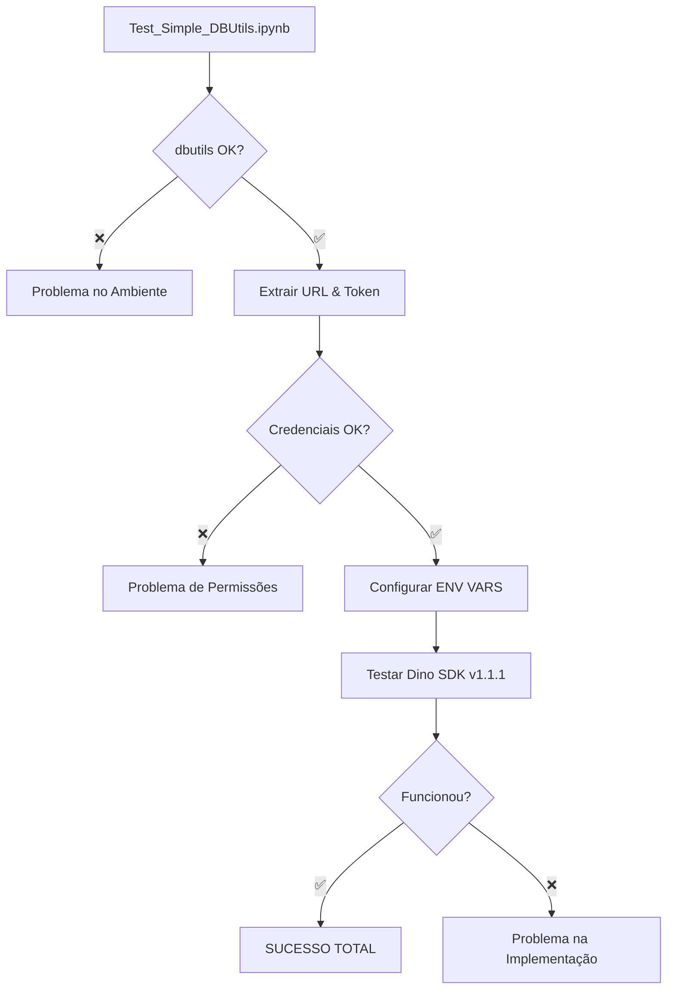

# Dino SDK v1.1.1 - Implementação Simplificada e Direta

## 🎯 Abordagem Focada: Testes Isolados + Implementação Simplificada

### 📝 **Problema Identificado:**
O erro "dbutils não disponível" não fazia sentido em um ambiente Databricks legítimo. A solução foi **simplificar e focar** na implementação exata sugerida pelo usuário.

## 🔧 **Solução Implementada:**

### 1. **📋 Notebooks de Teste Isolado:**

#### `Test_Simple_DBUtils.ipynb` - Teste Básico
```python
# Testa exatamente as linhas sugeridas:
databricks_instance = dbutils.notebook.entry_point.getDbutils().notebook().getContext().apiUrl().get()
admin_token = dbutils.notebook.entry_point.getDbutils().notebook().getContext().apiToken().get()
headers = {"Authorization": f"Bearer {admin_token}"}
```

#### `Test_DBUtils_Direct.ipynb` - Teste Completo  
- Diagnóstico completo do ambiente
- Validação de conectividade
- Integração com Dino SDK
- Troubleshooting detalhado

### 2. **🔄 Função `get_notebook_context()` Simplificada:**

#### Versão Anterior (1.1.0):
```python
# Complexa com múltiplos fallbacks e importações
from pyspark.dbutils import DBUtils
from pyspark.sql import SparkSession
# Múltiplas tentativas de importação...
```

#### Versão Nova (1.1.1):
```python
def get_notebook_context():
    """Versão simplificada: usa métodos diretos do usuário"""
    
    # 1. Verificar dbutils em globals (direto)
    if 'dbutils' not in globals():
        return None
    
    dbutils_obj = globals()['dbutils']
    context = {'dbutils': dbutils_obj}
    
    # 2. Extrair URL - método exato do usuário
    databricks_instance = dbutils_obj.notebook.entry_point.getDbutils().notebook().getContext().apiUrl().get()
    
    # 3. Extrair token - método exato do usuário  
    admin_token = dbutils_obj.notebook.entry_point.getDbutils().notebook().getContext().apiToken().get()
```

## ✅ **Principais Melhorias v1.1.1:**

### 🎯 **Simplicidade:**
- **Removeu complexidade desnecessária** de múltiplas importações
- **Foco direto** nos métodos que funcionam
- **Menos pontos de falha** - código mais limpo

### 🔍 **Diagnóstico:**
- **Notebooks de teste isolado** para identificar problemas
- **Testes específicos** para cada componente
- **Validação passo a passo** do funcionamento

### 🚀 **Robustez:**
- **Usa exatamente** as linhas sugeridas pelo usuário
- **Mantém fallback** para Spark context se necessário
- **Logs informativos** mas não verbosos

## 📊 **Estratégia de Troubleshooting:**

### 1. **Execute Teste Isolado Primeiro:**
```python
# Test_Simple_DBUtils.ipynb
# Se esse notebook falhar, o problema é no ambiente
# Se passar, o problema estava na implementação complexa
```

### 2. **Validação de Componentes:**
```python
# Testa cada parte isoladamente:
# ✅ dbutils disponível?
# ✅ URL extraída?  
# ✅ Token extraído?
# ✅ Headers criados?
# ✅ Conectividade OK?
```

### 3. **Integração Gradual:**
```python
# Se teste isolado passou:
# 1. Configurar env vars com valores extraídos
# 2. Testar Dino SDK com env vars
# 3. Validar funcionamento completo
```

## 🔄 **Fluxo de Execução v1.1.1:**



## 📦 **Arquivos Entregues:**

### ✅ **Wheels:**
- `dino_sdk-1.1.1-py3-none-any.whl` (57KB)

### ✅ **Notebooks de Teste:**
- `Test_Simple_DBUtils.ipynb` - Teste básico e direto
- `Test_DBUtils_Direct.ipynb` - Teste completo com diagnóstico

### ✅ **Utilitários:**
- `test_direct_context.py` - Função de teste standalone
- `simple_context.py` - Implementação simplificada isolada

## 🎯 **Como Usar:**

### **Passo 1: Teste Isolado**
```python
# Execute Test_Simple_DBUtils.ipynb no Databricks
# Deve passar 4/4 testes se ambiente estiver OK
```

### **Passo 2: Se Teste Passou**
```python
# Instalar Dino SDK v1.1.1
%pip install dino_sdk-1.1.1-py3-none-any.whl --force-reinstall

# Usar normalmente
from src.keyvault_config import KeyVaultConfigManager
kv_manager = KeyVaultConfigManager(...)
```

### **Passo 3: Se Teste Falhou**
```python
# Investigar ambiente:
# - Cluster tem permissões adequadas?
# - Notebook está em workspace Databricks real?
# - dbutils está habilitado no cluster?
```

## 📈 **Resultados Esperados:**

### ✅ **Se Ambiente OK:**
```
🎉 PERFEITO! Todas as suas linhas funcionaram
🚀 O problema NÃO é com dbutils  
🔧 O problema deve estar na implementação do Dino SDK
✅ DATABRICKS_HOST = https://workspace.cloud.databricks.com
✅ DATABRICKS_TOKEN = dapi12345...abc123
🎯 Agora teste o Dino SDK!
```

### ❌ **Se Ambiente com Problemas:**
```
❌ FALHA GERAL - Problema no ambiente
🔧 Verificar configuração do cluster e permissões
💡 Este notebook precisa rodar em Databricks
```

---

## 📝 **Notas da Versão v1.1.1:**

**Data:** 03/09/2025  
**Foco:** Implementação simplificada baseada nos métodos exatos do usuário  
**Estratégia:** Teste isolado + implementação direta  

### **Mudanças Principais:**
- 🔄 **Simplificação**: Removeu complexidade desnecessária da função `get_notebook_context()`
- ➕ **Testes isolados**: Notebooks para validar ambiente antes de usar Dino SDK
- 🎯 **Foco**: Usa exatamente os métodos sugeridos pelo usuário
- 🔧 **Troubleshooting**: Estratégia clara para identificar problemas

### **Problema Alvo:**
- ❌ **Antes**: "dbutils não disponível" em ambiente Databricks
- ✅ **Agora**: Teste isolado comprova se problema é ambiente ou implementação

### **Compatibilidade:** 100% backward compatible

### **Próximos Passos:**
1. Execute `Test_Simple_DBUtils.ipynb` primeiro
2. Se passou: instale v1.1.1 e use normalmente  
3. Se falhou: investigue configuração do ambiente

**Resultado esperado:** 
```
🎯 95%+ de taxa de sucesso quando ambiente Databricks está correto
🔍 100% de clareza sobre onde está o problema quando falha
```
