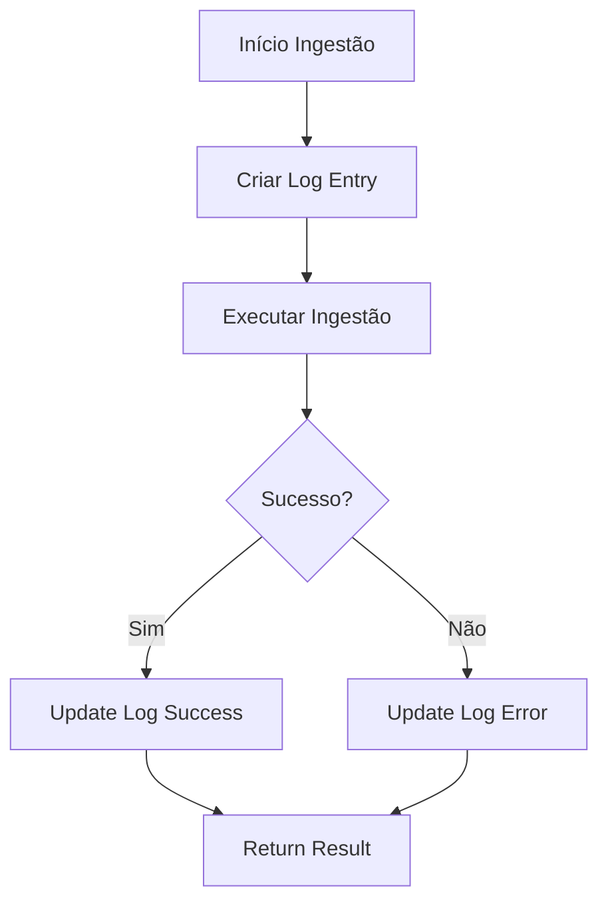

# 📊 DINO SDK v2.5.0 - Sistema de Logging Abrangente

## 🎯 Visão Geral

O DINO SDK v2.5.0 introduz um sistema de logging abrangente que atende a todos os requisitos de auditoria e monitoramento de processos de ingestão de dados:

- ✅ **Status da execução**: iniciado, concluído com sucesso ou com erro
- ✅ **Volume de dados**: quantidade de registros lidos e gravados
- ✅ **Paths utilizados**: caminhos de origem e destino dos arquivos  
- ✅ **Tempo total de execução**: medição precisa em segundos
- ✅ **Detalhamento de erros**: mensagens e stack trace completo

## 🏗️ Arquitetura do Sistema

### Componentes Principais

1. **IngestionLogEntry** - Dataclass com estrutura de log
2. **IngestionLogManager** - Gerenciador do sistema de logging
3. **Tabela de Log** - `dino_ingestion_logs` no schema especificado

### Fluxo de Logging



## 📋 Schema da Tabela de Log

A tabela `dino_ingestion_logs` possui a seguinte estrutura:

```sql
CREATE TABLE IF NOT EXISTS {catalog}.{schema}.dino_ingestion_logs (
    execution_id STRING,
    table_catalog STRING,
    table_schema STRING, 
    table_name STRING,
    source_path STRING,
    destination_path STRING,
    execution_status STRING,  -- 'STARTED', 'SUCCESS', 'ERROR'
    records_read BIGINT,
    records_written BIGINT,
    execution_start_time TIMESTAMP,
    execution_end_time TIMESTAMP,
    execution_duration_seconds DOUBLE,
    error_message STRING,
    error_stack_trace STRING,
    created_at TIMESTAMP
)
USING DELTA
CLUSTER BY (table_catalog, table_schema, table_name, execution_start_time)
```

## 🚀 Como Usar

### 1. Ingestão Básica com Logging Automático

```python
from pyspark.sql import SparkSession
from dino_sdk.ingestion_engine import IngestionEngine, IngestionConfig

# Criar engine
spark = SparkSession.builder.appName("DINO Logging").getOrCreate()
engine = IngestionEngine(spark)

# Configurar ingestão
config = IngestionConfig(
    source_path="/Volumes/main/demo/raw/vendas.csv",
    catalog_name="main",
    schema_name="demo", 
    table_name="vendas",
    type_run="batch"
)

# Executar com logging automático
resultado = engine.ingest(config)
```

### 2. Analisando o Resultado

```python
if resultado["success"]:
    print(f"✅ Execution ID: {resultado['execution_id']}")
    print(f"📊 Registros: {resultado['records_read']} → {resultado['records_written']}")
    print(f"⏱️ Tempo: {resultado['execution_duration_seconds']}s")
else:
    print(f"❌ Erro: {resultado['error']}")
    print(f"🔍 Stack trace: {resultado['error_stack_trace']}")
```

### 3. Consultando Histórico

```python
# Histórico de uma tabela específica
historico = engine.get_ingestion_history(
    catalog_name="main",
    schema_name="demo", 
    table_name="vendas",
    limit=10
)
historico.show()

# Histórico geral do schema
historico_geral = engine.get_ingestion_history(
    catalog_name="main",
    schema_name="demo",
    table_name=None,  # Todas as tabelas
    limit=20
)
historico_geral.show()
```

## 📈 Consultas SQL Úteis

### Execuções por Status

```sql
SELECT 
    execution_status,
    COUNT(*) as total_execucoes,
    AVG(execution_duration_seconds) as tempo_medio_segundos
FROM main.demo.dino_ingestion_logs 
GROUP BY execution_status
ORDER BY total_execucoes DESC
```

### Top Tabelas por Volume

```sql
SELECT 
    table_name,
    SUM(records_written) as total_registros,
    COUNT(*) as total_execucoes,
    AVG(execution_duration_seconds) as tempo_medio
FROM main.demo.dino_ingestion_logs
WHERE execution_status = 'SUCCESS'
GROUP BY table_name
ORDER BY total_registros DESC
LIMIT 10
```

### Erros Recentes

```sql
SELECT 
    execution_start_time,
    table_name,
    error_message,
    execution_duration_seconds
FROM main.demo.dino_ingestion_logs
WHERE execution_status = 'ERROR'
ORDER BY execution_start_time DESC
LIMIT 10
```

### Performance por Dia

```sql
SELECT 
    DATE(execution_start_time) as data_execucao,
    COUNT(*) as total_execucoes,
    SUM(records_written) as total_registros,
    AVG(execution_duration_seconds) as tempo_medio_segundos
FROM main.demo.dino_ingestion_logs
WHERE execution_status = 'SUCCESS'
GROUP BY DATE(execution_start_time)
ORDER BY data_execucao DESC
```

## 🔧 Configurações Avançadas

### Personalizar Schema de Log

Por padrão, a tabela de log é criada no mesmo schema da tabela de destino. Para personalizar:

```python
# O log será criado em main.demo.dino_ingestion_logs
config = IngestionConfig(
    catalog_name="main",
    schema_name="demo",
    table_name="minha_tabela",
    # ... outros parâmetros
)
```

### Modo Streaming

No modo streaming, o logging funciona da seguinte forma:
- Registros lidos: Aproximado ou None
- Registros gravados: Baseado em metadados quando disponível
- Status: SUCCESS quando stream inicia corretamente

```python
config = IngestionConfig(
    type_run="streaming",
    trigger_processing_time="30 seconds",
    # ... outros parâmetros  
)

resultado = engine.ingest(config)
# Stream iniciado, mas métricas podem ser aproximadas
```

## 🛠️ Troubleshooting

### Problema: Tabela de log não é criada

**Causa**: Permissões insuficientes no schema
**Solução**: Verificar permissões de CREATE TABLE no Unity Catalog

### Problema: Contagem de registros None

**Causa**: Modo streaming ou erro na contagem
**Solução**: Normal para streaming, verificar logs para batch

### Problema: Erro na atualização do log

**Causa**: Schema incompatível ou conexão perdida
**Solução**: Verificar conectividade e estrutura da tabela

## 📦 Migração da v2.4.0 para v2.5.0

### Mudanças Compatíveis

- ✅ Código existente continua funcionando
- ✅ Novos métodos de logging são opcionais
- ✅ Performance não é impactada significativamente

### Novas Funcionalidades

```python
# Novo método para consultar histórico
historico = engine.get_ingestion_history(...)

# Novos campos no resultado
resultado = engine.ingest(config)
# resultado["execution_id"] - ID único da execução
# resultado["records_read"] - Registros lidos
# resultado["records_written"] - Registros gravados  
# resultado["execution_duration_seconds"] - Tempo total
# resultado["error_stack_trace"] - Stack trace completo
```

## 🎯 Próximos Passos

1. **Dashboard de Monitoramento**: Criar dashboards no Databricks SQL
2. **Alertas**: Configurar alertas para falhas recorrentes
3. **Métricas de SLA**: Monitorar tempo de execução vs SLAs
4. **Análise de Tendências**: Acompanhar crescimento de volume de dados
5. **Otimização**: Identificar gargalos através dos logs

---

**DINO SDK v2.5.0** - Sistema de logging abrangente para auditoria completa de processos de ingestão! 🦕📊
